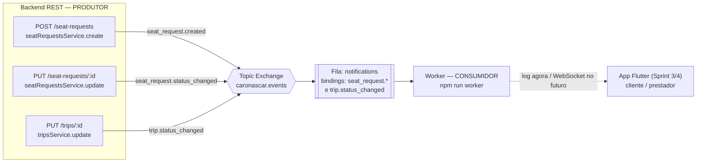

# Sprint 2 — Documentação dos Eventos (MOM / RabbitMQ)

Sistema **Caronascar**. O backend publica eventos de domínio em um **Topic Exchange**
durável do RabbitMQ (`caronascar.events`). Um worker independente (`npm run worker`)
assina esses eventos pela fila `notifications` e os processa de forma assíncrona.

## Fluxo de mensagens



A comunicação produtor → consumidor é **100% assíncrona**: a API responde ao cliente
HTTP imediatamente após gravar no banco e **publicar** a mensagem; quem reage ao evento
é o worker, em outro processo, **sem nenhuma chamada REST entre eles**.

## Tabela de eventos

| Evento (routing key) | Produtor | Consumidor | Exchange / Fila | Quando é publicado |
|---|---|---|---|---|
| `seat_request.created` | `seatRequestsService.create` (via `POST /seat-requests`) | Worker `notifications` (`src/messaging/consumer.ts`) | `caronascar.events` (topic) / `notifications` | Passageiro cria uma solicitação de vaga |
| `seat_request.status_changed` | `seatRequestsService.update` (via `PUT /seat-requests/:id`) | Worker `notifications` | `caronascar.events` / `notifications` | Motorista aceita/recusa (status muda) |
| `trip.status_changed` | `tripsService.update` (via `PUT /trips/:id`) | Worker `notifications` | `caronascar.events` / `notifications` | Viagem muda de estado (`started`/`completed`/`cancelled`) |

> A fila `notifications` faz dois *bindings* no exchange: `seat_request.*` (captura
> `created` e `status_changed`) e `trip.status_changed`.

## Envelope padrão

Toda mensagem usa o mesmo envelope (`src/messaging/events.ts`):

```json
{
  "event": "<routing key>",
  "occurredAt": "2026-06-01T12:00:00.000Z",
  "data": { }
}
```

## Exemplos de payload

### `seat_request.created`
```json
{
  "event": "seat_request.created",
  "occurredAt": "2026-06-01T12:00:00.000Z",
  "data": {
    "id": "8f1c2e10-...-aaa",
    "tripId": "3a9b...-bbb",
    "passengerId": "7c2d...-ccc",
    "seats": 1,
    "status": "pending"
  }
}
```

### `seat_request.status_changed`
```json
{
  "event": "seat_request.status_changed",
  "occurredAt": "2026-06-01T12:05:00.000Z",
  "data": {
    "id": "8f1c2e10-...-aaa",
    "tripId": "3a9b...-bbb",
    "passengerId": "7c2d...-ccc",
    "previousStatus": "pending",
    "status": "accepted"
  }
}
```

### `trip.status_changed`
```json
{
  "event": "trip.status_changed",
  "occurredAt": "2026-06-01T12:10:00.000Z",
  "data": {
    "id": "3a9b...-bbb",
    "driverId": "1d4e...-ddd",
    "previousStatus": "open",
    "status": "started"
  }
}
```

## Como observar (evidência)

1. `docker compose up -d` (sobe o RabbitMQ; painel em http://localhost:15672, guest/guest).
2. Terminal A: `npm run dev` (API) — loga `MOM (RabbitMQ) conectado e exchange declarado`.
3. Terminal B: `npm run worker` — loga `aguardando eventos na fila "notifications"`.
4. Faça uma ação (ex.: `POST /seat-requests` autenticado). No **Terminal A** aparece
   `[publisher] evento publicado: seat_request.created`; no **Terminal B**, a notificação
   `🔔 [notificação → motorista] ...`. No painel do RabbitMQ a fila `notifications`
   registra a mensagem trafegada.
