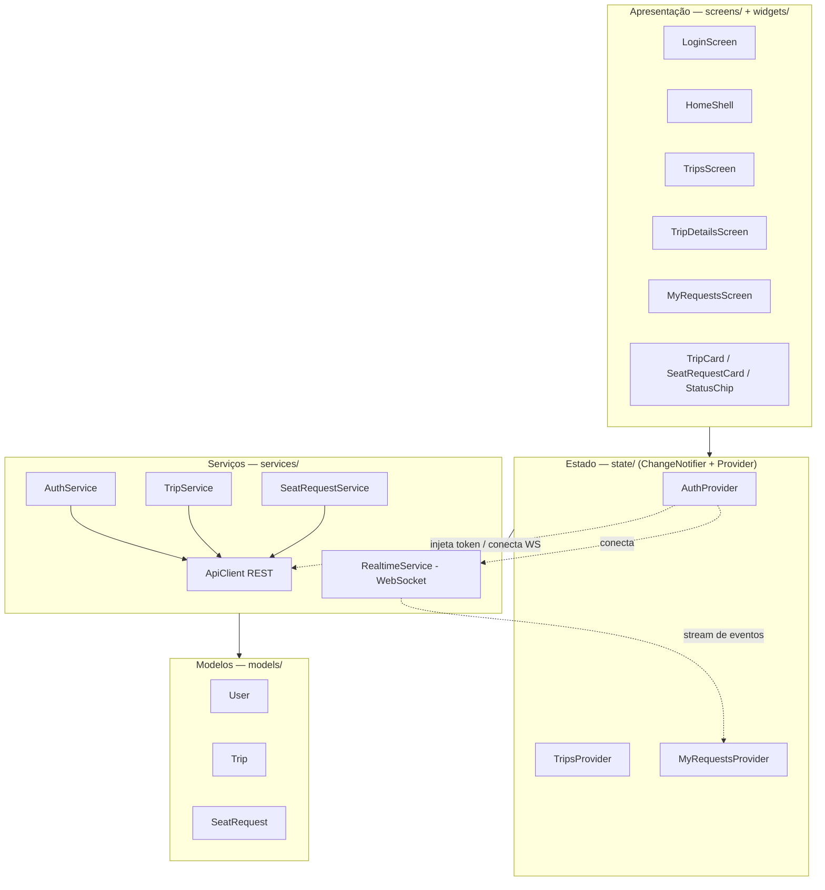
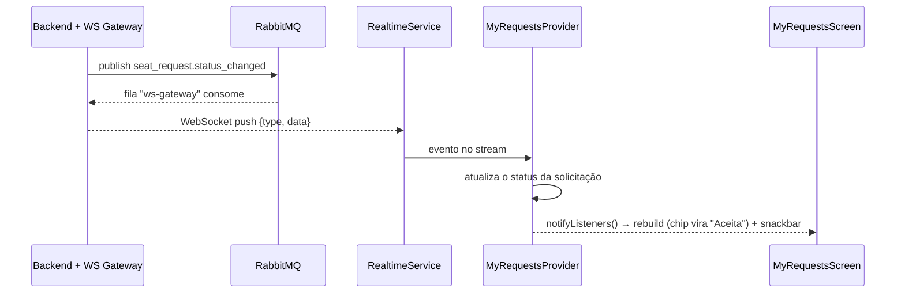

# Sprint 3 — Arquitetura do App Flutter (Cliente)

App do **passageiro** (`app_cliente/`), em Flutter + Provider, seguindo Clean Architecture:
camadas com dependência só "para baixo" (UI → estado → serviços → modelos).

## Camadas

| Camada | Pasta | Responsabilidade |
|---|---|---|
| Apresentação | `screens/`, `widgets/` | Telas e componentes visuais. Sem regra de negócio nem HTTP. |
| Estado | `state/` | `ChangeNotifier` por feature; orquestra serviços e expõe dados à UI. |
| Serviços | `services/` | Acesso a dados: REST (`ApiClient` + `*Service`) e tempo real (`RealtimeService`). |
| Modelos | `models/` | Entidades imutáveis com `fromJson` (`User`, `Trip`, `SeatRequest`). |
| Suporte | `config.dart`, `utils/` | Endereços do backend e helpers (ex.: formatação de data). |

## Telas (mínimo de 3 — entregamos 4 + login)

1. **TripsScreen** — listagem de viagens disponíveis (`GET /trips`, filtradas: abertas e com vaga).
2. **TripDetailsScreen** — detalhes + **ação principal**: solicitar vaga (`POST /seat-requests`).
3. **MyRequestsScreen** — minhas solicitações, com **atualização em tempo real**.
4. **LoginScreen** — login/cadastro (`POST /auth/login` e `/auth/register`).

## Integração com o backend REST

`ApiClient` centraliza base URL, cabeçalhos e o token JWT (injeta `Authorization: Bearer`).
Cada `*Service` traduz JSON ↔ modelos. Ex. de fluxo:

`TripsScreen` → `TripsProvider.load()` → `TripService.listAvailable()` → `ApiClient.get('/trips')` → backend.

## Atualização assíncrona de estado (WebSocket / MOM)

Quando o motorista aceita uma solicitação, o backend publica `seat_request.status_changed`
no RabbitMQ; o **gateway WebSocket** (no backend) consome esse evento e empurra para o
passageiro conectado. No app:

Ou seja: **sem polling** e **sem o usuário mexer na tela** — exatamente o critério de
"atualização assíncrona de estado" da Sprint 3. A escolha por WebSocket reaproveita o MOM
da Sprint 2 (o mesmo evento ainda vai, em paralelo, para o worker `notifications`).
